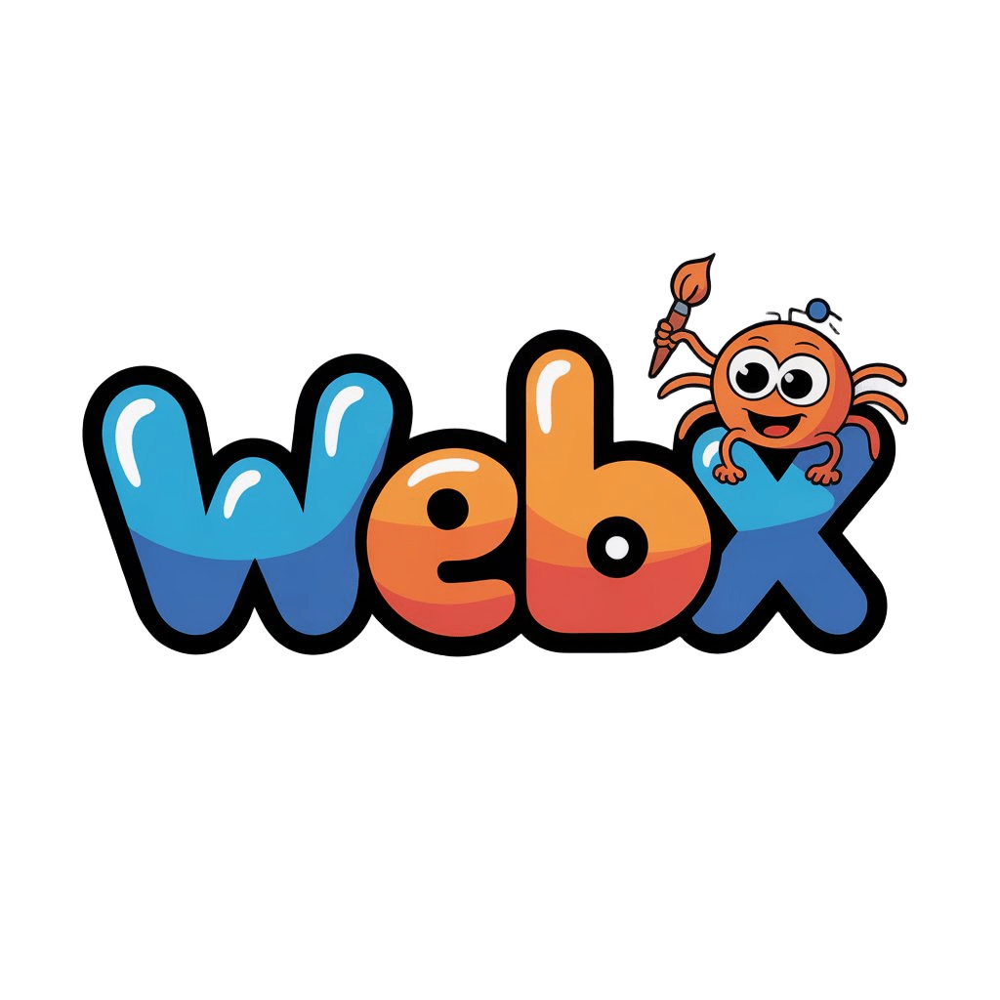

# webX



webX is a website export tool that scrapes a live site, reorganizes the downloaded assets, and packages the result into a ZIP file you can download locally.

## Features

- Export a site from a domain or URL.
- Choose the target platform: Webflow, Squarespace, or Framer.
- Control what gets exported, including CSS, JavaScript, images, media, and fonts.
- Rename the CSS and JS output folders.
- Crawl linked pages when you want a wider export.
- Remove common platform watermarks and badges.
- Keep pages as clean HTML files or force explicit `.html` extensions.
- Track export progress in real time and download the finished archive as a ZIP.

## Deployment

Host the frontend on Vercel and the backend on Fly.

Frontend:

- Deploy the `client/` folder to Vercel.
- Set `VITE_API_URL` to your Fly backend URL, for example `https://webx-backend.fly.dev`.

Backend:

- Deploy the `server/` folder with `flyctl`.
- The backend listens on `process.env.PORT`, so Fly can assign the runtime port automatically.

Typical Fly commands from the `server/` folder:

```bash
flyctl launch
flyctl deploy
```
